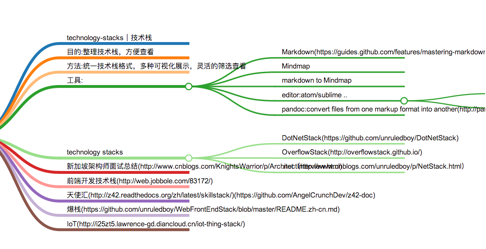

# technology-stacks｜技术栈

# 目的:整理技术栈，方便查看
# 方法:统一技术栈格式，多种可视化展示，灵活的筛选查看
# 协作:
# 工具:
## Markdown(https://guides.github.com/features/mastering-markdown/)
## Mindmap
## markdown to Mindmap
## editor:atom/sublime ..
### atom以及插件(atom.io)
#### atom-markdown-mindmap(https://github.com/dundalek/atom-markdown-mindmap)
### sublime text
##  pandoc:convert files from one markup format into another(http://pandoc.org/)
# technology stacks
## DotNetStack(https://github.com/unruledboy/DotNetStack)
## OverflowStack(http://overflowstack.github.io/)
## .net（http://www.cnblogs.com/unruledboy/p/NetStack.html）
操作系统
CLI
CLR
CTS/CLS/CIL
.NET Fx
CLI 语言
DLR
DLR 语言
Desktop 桌面
Web 网络
SOA
SDKs
OWIN
IDE 编辑器
Platforms 平台
Productivity 生产力
Build 编译
Testing 测试
Deploy 发布
Tools 工具
Data 数据存储
Components 组件
# 新加坡架构师面试总结(http://www.cnblogs.com/KnightsWarrior/p/ArchitectInterview.html)
# 前端开发技术栈(http://web.jobbole.com/83172/)
# 天使汇(http://z42.readthedocs.org/zh/latest/skillstack/)(https://github.com/AngelCrunchDev/z42-doc)
# 爆栈(https://github.com/unruledboy/WebFrontEndStack/blob/master/README.zh-cn.md)
# IoT(http://i25zt5.lawrence-gd.diancloud.cn/iot-thing-stack/)
